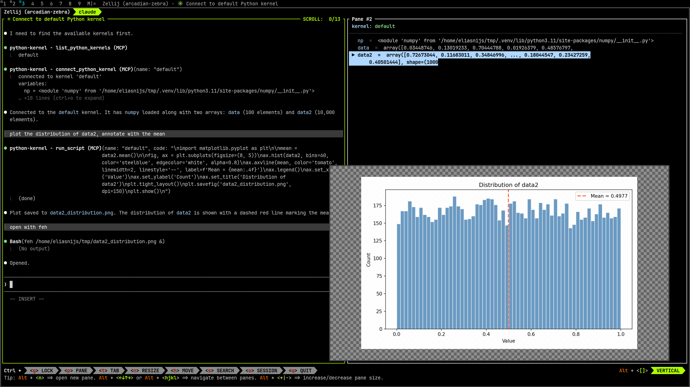

claude-python-kernel
====================

.. warning::

   This project was written with Claude Code and is not fully tested yet — use with caution.

Gives Claude Code access to a persistent Python kernel. Variables defined in
the kernel are visible to scripts Claude runs. Variables defined in scripts do
not flow back into the kernel.

.. toctree::
   :maxdepth: 2
   :caption: Contents

   usage
   api
